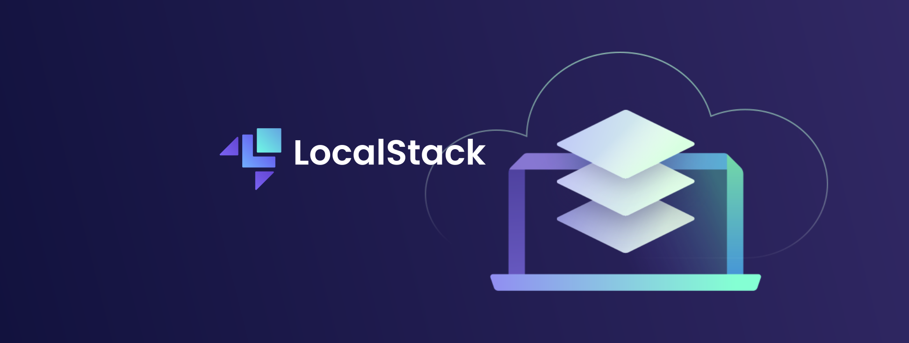

<p align="center">
  
</p>

# 🚀 LocalStack AWS Playground

Este projeto fornece um ambiente completo para simular serviços da AWS localmente usando LocalStack + Docker Compose, com exemplos em AWS CLI e Python (boto3).

Ideal para estudos, prototipação e testes sem custos na nuvem.

---

[](https://www.python.org/)
[](https://github.com/tvlemes/localstack/blob/main/LICENSE)
[]()

## 📂 Estrutura do Projeto

**`docker-compose.yml`** → Configuração do LocalStack e cliente Python.\
**`requirements.txt`** → Dependências Python (boto3, awscli).\
**`volume/tmp/init_services.py`** → Inicializa serviços básicos (S3, DynamoDB, VPC, Lambda, Glue).\
**`volume/tmp/full_init_services.py`** → Inicializa serviços básicos + extras (RDS, Glue avançado).

---

## ⚡ Serviços suportados (Community)

✅ S3 – Armazenamento de objetos\
✅ DynamoDB – Banco NoSQL\
✅ Lambda – Funções serverless\
✅ SQS / SNS – Fila e mensagens\
✅ EC2 (parcial) – Mock de instâncias e VPC\

⚠️ Glue e RDS estão disponíveis apenas na versão Pro/Team do LocalStack.

---

## ▶️ Como rodar
1. Subir os containers:
```bash
docker compose -f docker-compose.yml up -d
```

2. Verificar se o LocalStack está no ar:
```bash
curl http://localhost:4566/health
```

3. Acessar o container:
```bash
docker exec -it localstack bash
```

4. Configurar AWS CLI:
```bash
aws configure --profile localstack
AWS Access Key ID [None]: test
AWS Secret Access Key [None]: test
Default region name [None]: us-east-1
Default output format [None]: json
```

---

## 🐍 Scripts de inicialização
Inicialização básica:
```
python init_services.py
```

📌 Cria:
* S3 (meu-bucket-local)
* DynamoDB (Clientes)
* VPC (CIDR 10.0.0.0/16)
* Lambda simples (MinhaLambda)
* Glue (meu_db_glue)

Inicialização completa:
```
python full_init_services.py
```

📌 Cria tudo acima +
RDS simulado (meu-rds-local)

---

## 🛠️ Exemplos de uso
Criar bucket S3 via CLI:
```python
aws --profile localstack --endpoint-url=http://localhost:4566 s3 mb s3://meu-bucket
```


Upload e download:
```python
echo "Hello LocalStack" > teste.txt
aws --profile localstack --endpoint-url=http://localhost:4566 s3 cp teste.txt s3://meu-bucket/
aws --profile localstack --endpoint-url=http://localhost:4566 s3 cp s3://meu-bucket/teste.txt .
```

Criar tabela DynamoDB via Python:
```python
import boto3

dynamodb = boto3.client("dynamodb", endpoint_url="http://localhost:4566",
                        aws_access_key_id="test", aws_secret_access_key="test",
                        region_name="us-east-1")

dynamodb.create_table(
    TableName="Usuarios",
    KeySchema=[{"AttributeName": "id", "KeyType": "HASH"}],
    AttributeDefinitions=[{"AttributeName": "id", "AttributeType": "S"}],
    ProvisionedThroughput={"ReadCapacityUnits": 5, "WriteCapacityUnits": 5}
)
print(dynamodb.list_tables())
```

---

## 📦 Requisitos
Docker + Docker Compose:

Python 3.11+ com dependências:
```python
pip install -r requirements.txt
```

---

## ✨ Dicas rápidas

* Para acessar serviços do host: use --endpoint-url http://localhost:4566\
* Para acessar dentro do container python-client: use http://localstack:4566\
* Use long polling no SQS para evitar polling excessivo.\
* Configure DLQs (Dead Letter Queues) para filas críticas.

---

## 📜 Licença
<a href='https://github.com/tvlemes/localstack/blob/main/LICENSE'>MIT © Thiago Vilarinho Lemes</a>


---

## 👨‍💻 Sobre

👤 Autor: Thiago Vilarinho Lemes <br>
🏠 Home: https://thiagolemes.netlify.app/ \
🔗 LinkedIn: <a href="https://www.linkedin.com/in/thiago-v-lemes-b1232727" target="_blank">Thiago Lemes</a><br>
📄 e-mail: contatothiagolemes@gmail.com | lemes_vilarinho@yahoo.com.br

